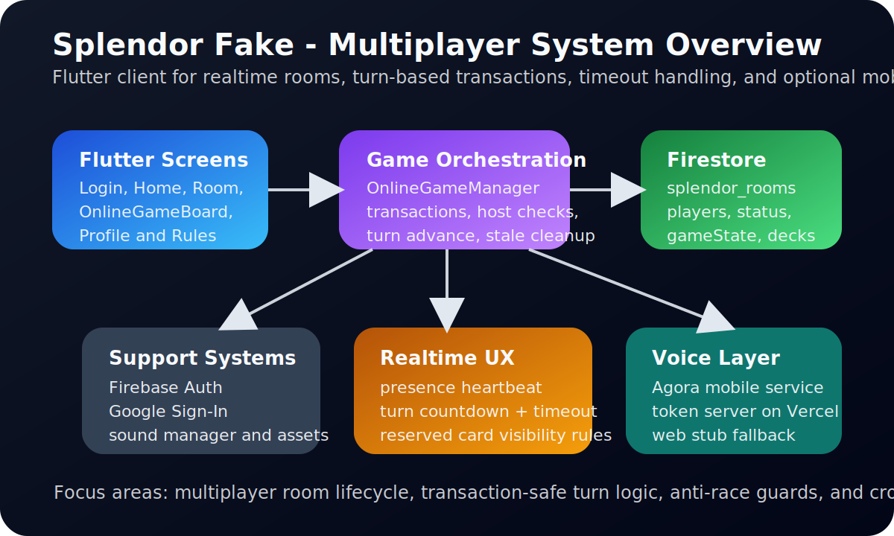

# Splendor Fake

Game thẻ bài nhiều người chơi lấy cảm hứng từ Splendor, xây dựng bằng Flutter, Firebase và voice chat Agora trên mobile.


## Giới thiệu

Đây là game online theo lượt, cho phép người chơi đăng nhập, vào phòng, thiết lập bàn chơi và chơi realtime với nhau trên cùng một room Firestore.

Ngoài chế độ online, dự án còn có:

- chế độ tập luyện ngay trên máy
- màn hình xem luật chơi
- kho thẻ để xem nhanh bộ bài và tài nguyên
- voice chat trên mobile

## Xem nhanh kiến trúc



## Chức năng nổi bật

- Đăng nhập Google và lưu hồ sơ người chơi
- 5 bàn online realtime bằng Firestore
- Chơi Splendor theo lượt với token, thẻ, quý tộc và tính điểm
- Host chỉnh cấu hình bàn chơi trước khi bắt đầu
- Đồng bộ thời gian lượt chơi và tự hết lượt khi hết giờ
- Dọn người chơi treo và xử lý rời phòng
- Voice chat trên mobile
- Chế độ tập luyện ngay trong app

## Toàn bộ chức năng hiện có trong game

### 1. Tài khoản và hồ sơ người chơi

- Đăng nhập bằng Google Sign-In
- Lưu hồ sơ người chơi vào Firestore
- Chỉnh tên hiển thị
- Chọn avatar cho người chơi
- Hiển thị avatar trong sảnh, phòng và bàn chơi
- Đăng xuất tài khoản

### 2. Sảnh và điều hướng trong app

- Màn hình luật chơi
- Chế độ `Tập Luyện`
- Màn hình `Kho Thẻ` để xem bộ bài và tài nguyên
- Danh sách các bàn online theo thời gian thực
- Hiển thị trạng thái từng bàn
- Hiển thị số người chơi hiện tại trên từng bàn
- Tự khôi phục các room mặc định nếu bị thiếu trong Firestore

### 3. Phòng online

- 5 phòng cố định `room_1` đến `room_5`
- Vào phòng từ sảnh
- Rời phòng bất cứ lúc nào
- Tự rejoin khi người chơi quay lại đúng room
- Hiển thị danh sách người chơi trong phòng
- Hiển thị chủ phòng
- Chặn vào nếu phòng đã đầy
- Host chỉnh số người chơi tối đa
- Host chỉnh thời gian mỗi lượt
- Host chỉnh số điểm chiến thắng
- Host bắt đầu ván khi đủ điều kiện
- Đồng bộ thay đổi phòng theo thời gian thực

### 4. Gameplay online

- Chơi theo lượt nhiều người
- Đồng bộ trạng thái game realtime qua Firestore
- Lấy 3 token khác màu
- Lấy 2 token cùng màu khi đủ điều kiện
- Không cho lấy vượt luật
- Mua thẻ phát triển từ bàn
- Giữ thẻ mở trên bàn
- Giữ thẻ úp từ chồng bài
- Nhận vàng khi giữ thẻ nếu ngân hàng còn
- Giới hạn số thẻ giữ trên tay
- Tính bonus vĩnh viễn từ thẻ đã mua
- Tự kiểm tra đủ tài nguyên để mua thẻ
- Tự trả token về ngân hàng khi mua
- Tự nhận quý tộc khi đủ điều kiện
- Tính điểm realtime
- Kết thúc game khi đạt mốc điểm thắng
- Hiển thị màn hình chiến thắng

### 5. Đồng bộ lượt chơi và an toàn trạng thái

- Đồng bộ timer lượt chơi
- Hiển thị thời gian còn lại của lượt hiện tại
- Tự hết lượt khi hết thời gian
- Force end turn khi cần
- Presence heartbeat khi đang ở trong bàn
- Tự dọn người chơi stale/inactive
- Chuyển host nếu host cũ rời phòng
- Xử lý host rời khi đang trong game
- Xử lý người chơi thường rời khi đang trong game
- Reset session đúng theo vòng đời room
- Dùng Firestore transaction cho các thao tác quan trọng để tránh ghi đè sai trạng thái

### 6. Giao diện bàn chơi

- Hiển thị avatar tất cả người chơi
- Viền timer theo người đang đến lượt
- Hiển thị token đang có của từng người chơi
- Hiển thị bonus từ thẻ đã mua
- Hiển thị quý tộc đã nhận
- Hiển thị điểm hiện tại
- Hiển thị thẻ đang giữ
- Hiển thị các hàng thẻ theo cấp
- Hiển thị ngân hàng token
- Hiển thị thanh điều khiển cho người chơi hiện tại
- Toast thông báo hành động hợp lệ/không hợp lệ
- Animation khi lấy token và cập nhật trạng thái

### 7. Voice chat

- Voice chat theo room trên mobile
- Bật/tắt microphone ngay trong bàn chơi
- Tách riêng service voice để web vẫn chạy gameplay bình thường
- Dùng token server riêng cho Agora

### 8. Chế độ tập luyện

- Vào game ngay không cần room online
- Chơi theo luật Splendor trên máy
- Có timer lượt
- Có bot xử lý lượt tự động
- Tính điểm và xác định người thắng

## Công nghệ sử dụng

| Công nghệ | Vai trò |
| --- | --- |
| Flutter | Client đa nền tảng |
| Firebase Auth | Đăng nhập và định danh người chơi |
| Cloud Firestore | Room realtime và game state |
| Provider / shared_preferences | Hỗ trợ state và cấu hình cục bộ |
| Agora RTC | Voice chat mobile |
| Node + Vercel | Token server cho Agora |
| GitHub Actions | Workflow kiểm tra mã nguồn |

## Cấu trúc dự án

```text
splendor_fake/
|-- lib/
|   |-- screens/       # các màn hình chính
|   |-- logic/         # game logic và online game manager
|   |-- models/        # entity room/game/player
|   |-- services/      # voice service abstraction
|   |-- widgets/       # widget bàn chơi, thẻ, token, quý tộc
|-- test/
|-- agora-token-server/
|-- docs/images/
|-- android/ ios/ web/
```

## Cài đặt và chạy local

### Yêu cầu

- Flutter SDK 3.x
- Firebase project có Auth và Firestore
- Agora project nếu muốn bật voice chat mobile

### Cài package

```bash
flutter pub get
```

### Cấu hình Firebase

Các file cấu hình Firebase theo máy/project không được commit trực tiếp trong repo. Khi chạy local, cần chuẩn bị:

- `android/app/google-services.json`
- `ios/Runner/GoogleService-Info.plist` nếu build iOS
- `lib/firebase_options.dart`

Có thể tạo nhanh bằng FlutterFire:

```bash
dart pub global activate flutterfire_cli
flutterfire configure
flutter pub get
```

Repo có sẵn file mẫu:

- `lib/firebase_options.example.dart`

### Chạy app

```bash
flutter run
```

### Chạy web

```bash
flutter run -d chrome
```

## Cấu trúc dữ liệu Firestore

Các collection chính:

- `splendor_users/{uid}`: hồ sơ người chơi
- `splendor_rooms/{roomId}`: thông tin phòng, danh sách người chơi, cấu hình và game state
- `splendor_time/now`: đồng bộ thời gian máy chủ cho timer lượt

Repo có sẵn:

- `firestore.rules`
- `firestore.indexes.json`

## Voice chat Agora

Voice chat là tính năng tùy chọn trên mobile.

Repo có sẵn ví dụ token server tại:

- `agora-token-server/`

Chạy local token server:

```bash
cd agora-token-server
npm install
copy .env.example .env
vercel dev
```

Biến môi trường cần có:

- `AGORA_APP_ID`
- `AGORA_APP_CERTIFICATE`

Sau đó cập nhật endpoint token trong `lib/services/voice_service_mobile.dart`.

## Ghi chú khi dùng chung Firebase project với app khác

Nếu cùng một Firebase project đang được dùng cho nhiều app khác nhau, Firestore Rules cần được quản lý theo kiểu hợp nhất vì rules áp dụng cho toàn bộ database.

Namespace chính của game hiện tại là:

- `splendor_users`
- `splendor_rooms`
- `splendor_time`

## Build Android

```bash
flutter clean
flutter pub get
flutter build apk --release
```

## Tác giả

Built by [Tran Dinh Duong](https://github.com/Duong200x).
